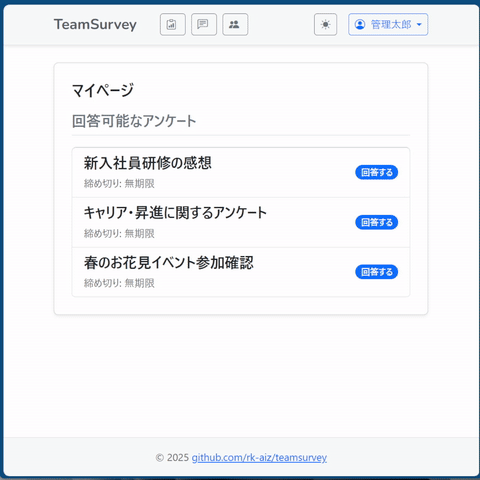

# TeamSurvey

### 概要 (Overview)

    社内やチーム内での利用を想定した、オンラインアンケートシステムです。
    管理者がアンケートを作成・配布し、ユーザーが回答、結果を集計する一連のフローを提供します。

## Demo



## ディレクトリ構造 (Directory Structure)

プロジェクトの全体構造は以下の通りです。
ソースコードだけでなく、環境構築用のDocker設定やドキュメント類もリポジトリ内で管理しています。

```text
teamsurvey/
├── docker/ ........................ Docker環境構築用ファイル
│   ├── app/ ....................... Javaアプリ用Dockerfile
│   └── db/ ........................ DB初期設定など
│
├── docs/ .......................... プロジェクトドキュメント
│   ├── schema/ .................... DB定義書 (SchemaSpy自動生成出力先)
│   └── design/ .................... 設計等の詳細資料
│
├── src/main/java/com/github/rk_aiz/teamsurvey/
│   ├── presentation/ .............. [Web層] View
│   ├── application/ ............... [アプリ層] Controller, Form
│   ├── domain/ .................... [ドメイン層] Service, Domain Object
│   └── infrastructure/ ............ [インフラ層] Repository, Mapper
│
├── docker-compose.yml ................... Docker Compose設定ファイル
└── build.gradle ........................ Gradle依存関係定義

```

## 技術スタック (Tech Stack)

- **Java 21** / **Spring Boot 4**
- **PostgreSQL 16**
- **MyBatis**
- **Thymeleaf**
- **Docker** / **Docker Compose**

## 使い方 (Usage)

Dockerを使用して、ローカル環境で簡単にアプリケーションを起動できます。

### 起動手順

1. プロジェクトのルートディレクトリで以下のコマンドを実行し、コンテナをビルド・起動します。
    ```bash
    docker-compose up -d --build
    ```
2. 起動後、ブラウザで以下のURLにアクセスしてください。
    - [http://localhost:9876](http://localhost:9876)

### 停止手順

以下のコマンドを実行して、コンテナを停止・削除します。

```bash
docker-compose down
```

## ドキュメント (Documentation)

本プロジェクトの要件定義や設計ついては、以下のドキュメントを参照してください。

- **[要件定義書](./docs/要件定義書.md)**

- **[基本設計書](./docs/design/基本設計書.xlsx)**

- **[データベース定義(SchemaSpy)](https://rk-aiz.github.io/teamsurvey/index.html)**
